<h2>Welcome</h2>

This project is for tracking Google SEO ranking by scraping Google URL 

In this project, react.js is used as front-end, and .NET 8 is used as back-end, SQL Express is also used as the database to store historical data/ dummy data.

<h2>Prerequisite</h2>
<ul><li>Both front-end and back-end solutions are implemented through Visual Studio Code, the set-up tutorial would use macOS terminal.  Windows users should run similar commands. </li>
<li>SQL Express uses SSMS to store dummy data, for complete experience, please make sure SSMS and SQL Express are installed.</li></ul>
<h2>Set-up</h2>

Please make sure everything is running before starting to test the systems

<h4>Node.js and npm</h4>

Please proceed to install node.js and npm in the following link: <a href="https://nodejs.org/en/download/prebuilt-installer"> Download Nodejs and npm </a>

After installing node.js and npm, and cloning the project, open terminal and locate the directory: infotrackfe 

Enter the command: npm start

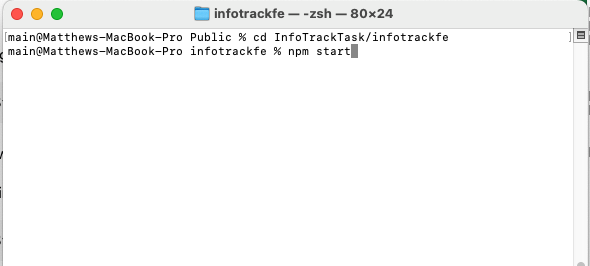

The react project will start now, when it is running, the command panel will show messages:

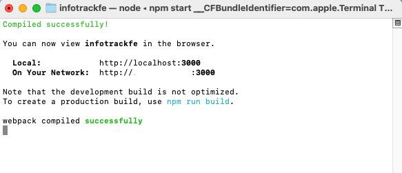
<h4>.NET8</h4>

The back-end project uses .NET8. Make sure .NET8 is installed, SDK link can be found here: <a href="https://dotnet.microsoft.com/en-us/download/dotnet/8.0">Download .NET8 SDK </a>

Open terminal and locate the directory: infotrackbe

Enter the command: dotnet run

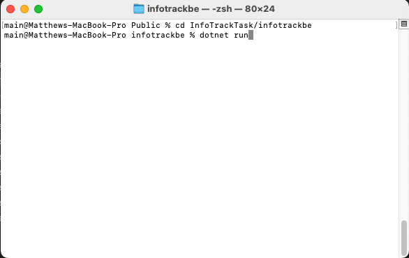

The react project will start now, when it is running, the command panel will show messages:

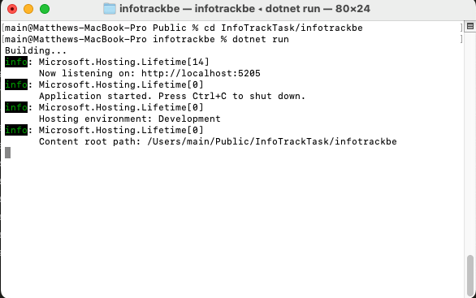
<h4>Database</h4>

During development, SQL express is started in a docker container in a macOS machine, please change the connection string if needed, the connection string can be found in the .net project/appsettings.json: 

<code style="background-color: lightyellow;"> "DefaultConnection": "Server=tcp:127.0.0.1,1433;Database=InfoTrack;User Id=SA;Password=reallyStrongPwd123;Persist Security Info=False;Encrypt=False;"</code>

Connection string is not encrypted, and there is no user id assignation for database access. This set-up is only for development purpose.

Database set-up script could be found in the file infotrackbe/infotrackdatabase/DataBase.sql, execute the script and the following will be created:
<ul><li>Database: InfoTrack</li>
<li>Table: sysHistory</li>
<li>Dummy Data for testing</li></ul>

 
<h2>Using and Testing</h2>

To use the program, open at browser <a href="http://localhost:3000">http://localhost:3000</a>, the index page of the website will be presented.

<h4>SEO ranking look-up</h4>
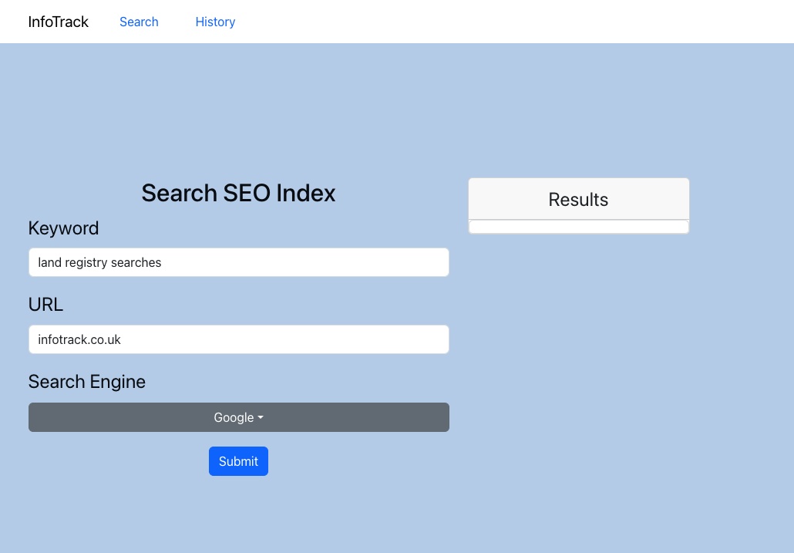

The 3 input values have default values according to the scope of the project, but they are editable. Choosing 'Bing' in the dropdown list will get the SEO ranking from Bing. However, Bing would not show 100 results in the scraping process, it would only show 30. To Get the current SEO ranking, press the Submit button.

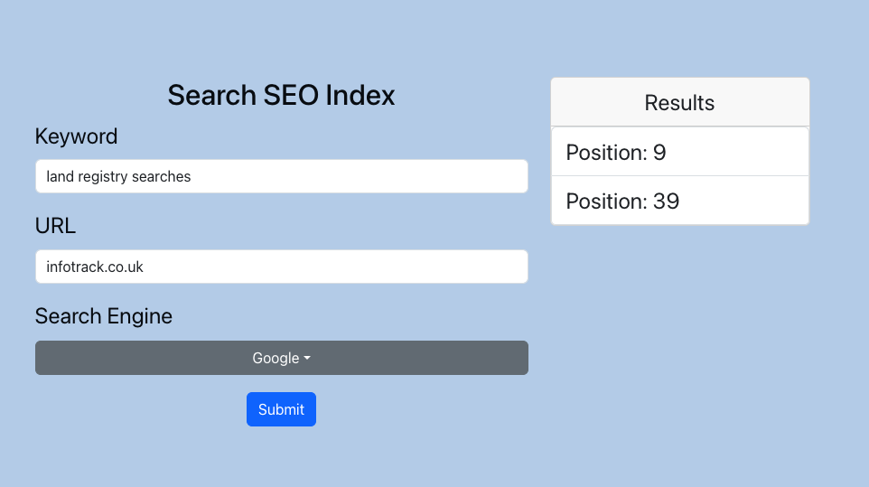
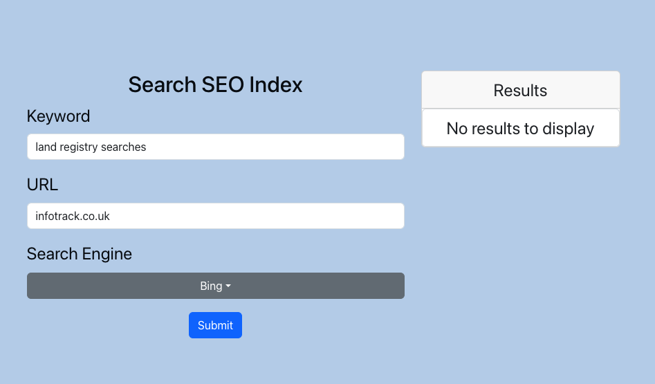

If it returns with ranking(s), the results will be shown in the grid on the right.

If the targeted website cannot be found in the searching in search engine, it will return "No Results To Display".

Both successful results would be stored in the database, and would be presented in the table grid below.

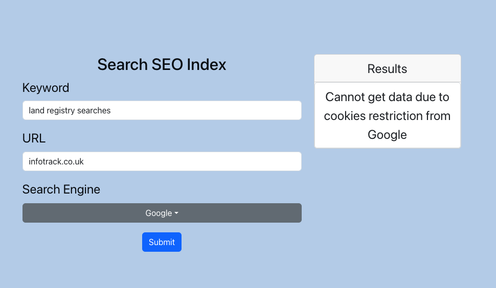

Google has a strict access to automatically calling their url, fequent attempt would result to not being able to return any data. In that case, the result box would display "Cannot get data due to cookie restriction from Google". If his message is shown, please wait for a short period of time before clicking the Submit button.

<h4>SEO history</h4>

The history tab could be accessed on the navbar, click Records in the navbar.

2 sections would be shown in the record page: history graph and history table.

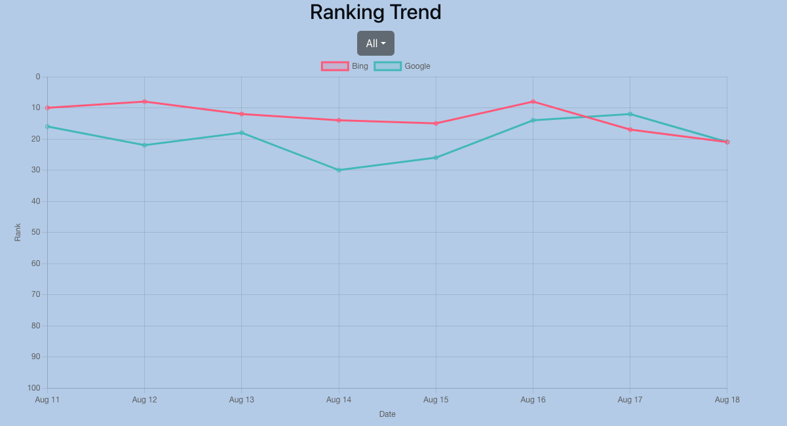

The graph shows the records of historical data in the database, it shows the daily positions of the website "infotrack.co.uk" when the keyword "land registry searches" are searched in both Google and Bing. Ideally, when the API program keeps running, a schedule task could set on both Windows or macOS environment to trigger the automation API call so that the system can get the figures and insert them into the database daily, for now it is using dummy data from the database to present. Only auto-inserted data or dummy data could be presented on the graph, data that was created by user triggering, would not be included in the graph. User can choose to view only one line by choosing the options in the dropdown list, or by clicking the coloured rectangle to remove the line.

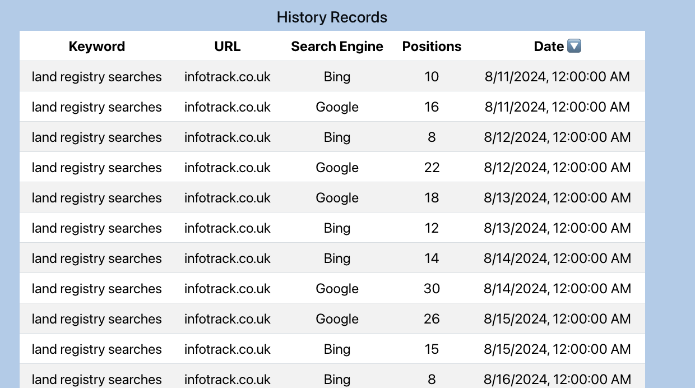

Every successfully retrieved data are stored in the table grid, the button next to the date column is for sorting the table order by the date. Data on the table grid are all extracted from the database through Entity Framework.

<h2>API</h2>
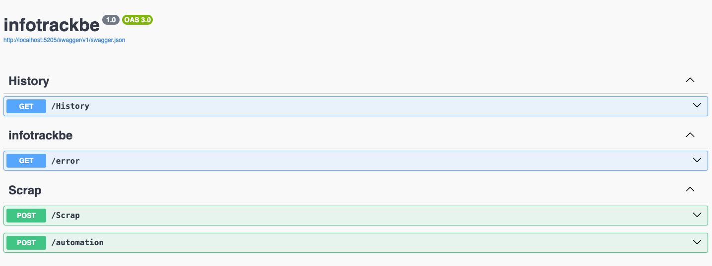

There are 3 API created in back-end to handle business needs:

<ol><li>GET Method: History - It gets all the history data from the database.</li>
<li>POST Method: Scrap - It scraps SEO ranking on user's request, and saves the record if the process is successful.</li>
<li>POST Method: Automation - It scraps SEO ranking and save the record to the database, allowing data to be displayed in the front-end history graph. It is made to be paired with scheduled jobs.</li></ol>
<h2>Additional Material</h2>

Setting up the scheduled jobs is not necessary in this project, it is a nice to have feature in a practical environment, in which every components of this project are set inside one local enviornment. Here are some simple suggestions for schedule jobs settings:

<h4>Windows Powershell Script and Task Scheduler</h4>

The Powershell script is located in the additionalScript/Windows folder, locate the file, and follow this guide to set up task scheduler: <a href="https://sqlbackupandftp.com/blog/how-to-schedule-a-script-via-windows-task-scheduler/">Task Scheduler Set-Up</a>

<h4>'macOS Shell Script and launchd</h4>

The scripts are located in the additionalScript/macOS. The api_call.sh file is the executable file, whereas the com.infotrack.api_call.plist file is the launchd schedule instruction script.

Locate the api_call.sh file and type this command to make it executable <code style="background-color: lightyellow;"><em>chmod +x /path/to/api_call.sh</em></code>

Place the plist file com.infotrack.api_call.plist to this location: ~/Library/LaunchAgents/, replace the path of .sh file in the plist file if necessary.

Load the file with this command: <code style="background-color: lightyellow;"><em>launchctl bootstrap gui/{your-user-id} com.infotrack.api_call.plist</em></code>, replace your user id in the command.

A detailed reference could be found here: <a href="https://davidhamann.de/2018/03/13/setting-up-a-launchagent-macos-cron/">macOS Cronjob Set-Up</a>

Both jobs are now scheduled to run at 1am everyday to scrap and load data.

